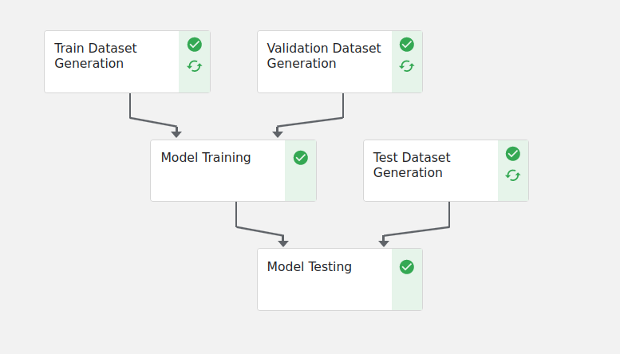

<div align="center">

    &nbsp;&nbsp;&nbsp;&nbsp;

    <h3>GeneFusion over Kubernetes</h3>
    <p><b>Index Keys:</b> <a href="https://ml-ops.org/">MLOps</a>, <a href="https://www.docker.com/">Docker</a>, <a href="https://kubernetes.io/it/">Kubernetes</a>, <a href="https://www.kubeflow.org/">Kubeflow</a>
</div>

- [Introduzione](https://github.com/antoniogrv/kube-gf#introduzione)
- [Installazione del sistema](https://github.com/antoniogrv/kube-gf#installazione-del-sistema)
- [Eseguire la pipeline](https://github.com/antoniogrv/kube-gf#eseguire-la-pipeline)
    - [Caricare le immagini Docker](https://github.com/antoniogrv/kube-gf#caricare-le-immagini-docker)
        - [Dataset Generation Docker Image](https://github.com/antoniogrv/kube-gf#dataset-generation-docker-image)
        - [Model Training & Testing Docker Image](https://github.com/antoniogrv/kube-gf#model-training--testing-docker-image)
    - [Compilare la pipeline con Miniconda](https://github.com/antoniogrv/kube-gf#compilare-la-pipeline-con-miniconda)
    - [Caricare la pipeline su Kubeflow](https://github.com/antoniogrv/kube-gf#caricare-la-pipeline-su-kubeflow)
- [Sviluppo della pipeline](https://github.com/antoniogrv/kube-gf#sviluppo-della-pipeline)
  - [Interagire col Docker Registry on-prem](https://github.com/antoniogrv/kube-gf#interagire-col-docker-registry-on-prem)
  - [Creazione dei componenti](https://github.com/antoniogrv/kube-gf#creazione-dei-componenti)
- [Considerazioni di MLSecOps](https://github.com/antoniogrv/kube-gf#considerazioni-di-mlsecops)

<hr>

## Introduzione

Questo progetto di tesi magistrale mira a realizzare un'architettura distribuita altamente scalabile per carichi di lavoro di machine learning. In particolare, il sistema è stato tarato per l'analisi di sequenze di DNA e RNA, e per l'individuazione di geni di fusione.

Il sistema prevede un'infrastruttura [Kubernetes](https://kubernetes.io/) su cui è possibile eseguire pipeline di machine learning e deep learning, realizzata tramite [Kubeflow](https://www.google.com/url?sa=t&rct=j&q=&esrc=s&source=web&cd=&cad=rja&uact=8&ved=2ahUKEwjr6v-2w7aCAxXB7rsIHdDAB9cQFnoECAUQAQ&url=https%3A%2F%2Fwww.kubeflow.org%2F&usg=AOvVaw1tztWtYKkDzF2NfjQYKzjX&opi=89978449) e sviluppata localmente con [Kind](https://www.google.com/url?sa=t&rct=j&q=&esrc=s&source=web&cd=&cad=rja&uact=8&ved=2ahUKEwj8-u-_w7aCAxUy9LsIHVkDDuoQFnoECAYQAQ&url=https%3A%2F%2Fkind.sigs.k8s.io%2F&usg=AOvVaw2TejnqsY1pFP0Qa5QJ0v6F&opi=89978449). L'architettura può essere eseguita su qualsiasi cluster Kubernetes, sia esso on-prem o cloud-native (e.g. [EKS](https://aws.amazon.com/it/eks/)). Come possibile istanza di un problema che l'architettura potrebbe accogliere, il [modello monolitico GeneFusion](https://github.com/FLaTNNBio/gene-fusion-kmer) è stato scorporato in microservizi, ognuno dei quali è stato containerizzato e reso disponibile tramite un [Docker Registry self-hosted](https://hub.docker.com/_/registry). Questi container, opportunamente orchestrati, convergono in una pipeline programmatica, robusta e sicura.

## Installazione del sistema

Il bootstrap del progetto prevede la creazione di un cluster Kubernetes, l'applicazione dei manifesti Kubeflow e attività di validazione della correttezza dell'installazione. Per maggiori informazioni sull'architettura del sistema, referenziare la sezione apposita.

> **Questo progetto non è compatibile con ambienti Windows.** E' strettamente necessario utilizzare un ambiente Linux. Qualsiasi tentativo di far combaciare le dipendenze richieste su [WSL](https://learn.microsoft.com/it-it/windows/wsl/) non produrrà i risultati auspicati. Inoltre, si sconsiglia di utilizzare macchine virtuali che non supportino la virtualizzazione hardware della GPU (e.g. [VirtualBox](https://www.virtualbox.org/)) poiché potrebbe generare conflitti con l'installazione del sistema. Si consiglia, pertanto, di utilizzare un'installazione nativa di Linux.

Prima di procedere, assicurarsi di aver installato correttamente le seguenti tecnologie:
- [Docker](https://docs.docker.com/engine/install/)
- [Kind](https://kind.sigs.k8s.io/docs/user/quick-start/#installation)
- [Helm](https://helm.sh/docs/intro/install/)
- [kubectl](https://kubernetes.io/docs/tasks/tools/install-kubectl-linux/)
- [git](https://git-scm.com/book/en/v2/Getting-Started-Installing-Git)

Inoltre, per garantire il supporto della GPU sono necessarie le seguenti dipendenze:
- [NVIDIA Container Toolkit](https://docs.nvidia.com/datacenter/cloud-native/container-toolkit/latest/install-guide.html#installation)
- [NVIDIA Drivers](https://www.nvidia.com/en-us/drivers/unix/)

> Su Ubuntu, non è necessario installare i driver NVIDIA, poiché pre-installati autonomamente dalla distribuzione. Tuttavia, è necessario installare il container toolkit.

Infine, per quanto non sia strettamente necessario, si consiglia l'installazione di [Miniconda](https://conda.io/miniconda.html) per la gestione degli ambienti Python.

1. Clonare la repository [kube-gf](https://github.com/antoniogrv/kube-gf) e accertarsi che il Docker Daemon sia in esecuzione.

```
git clone https://github.com/antoniogrv/kube-gf.git
cd kube-gf
sudo systemctl status docker
```

2. Eseguire lo script di provisioning del cluster locale Kubernetes con supporto per la GPU tramite la CLI di Kind; una volta creato, tarare la CLI di `kubectl` sul nuovo cluster Kind.

> L'esecuzione dei comandi da terminali di `docker`, `kind` e `kubectl` potrebbe richiedere i privilegi da amministratore (`sudo`).

```
chmod +x kube-pipe/kind/boot-kind-gpu.sh
./kube-pipe/kind/boot-kind-gpu.sh
kubectl cluster-info --context kind-kind
```

3. Verificare che il contenuto del file `/etc/docker/daemon.json` sia **esattamente** come segue. In caso di difformità, sostituire in toto il contenuto del file con quello indicato.
```json
{
  "default-runtime": "nvidia",
  "runtimes": {
    "nvidia": {
      "args": [],
      "path": "nvidia-container-runtime"
    }
  }
}
```

4. Riavviare il Docker Daemon. Successivamente, dare visione della GPU al nodo Kubernetes iniettando un file di configurazione all'interno del container. Si tratta di un workaround per [prevenire alcuni problemi ben noti](https://github.com/NVIDIA/nvidia-docker/issues/614#issuecomment-423991632).
```
sudo systemctl restart docker
docker exec -ti substratus-control-plane ln -s /sbin/ldconfig /sbin/ldconfig.real
```

5. Installare il [Kubernetes Operator](https://kubernetes.io/docs/concepts/extend-kubernetes/operator/) per il rilevamento e l'etichettamento della disponibilità della GPU sui nodi ([NVIDIA GPU Operator](https://github.com/NVIDIA/gpu-operator#nvidia-gpu-operator)). Quest'operazione potrebbe richiedere diverso tempo.
```console
helm repo add nvidia https://helm.ngc.nvidia.com/nvidia || true
helm repo update
helm install --wait --generate-name \
     -n gpu-operator --create-namespace \
     nvidia/gpu-operator --set driver.enabled=false
```

6. Applicare i manifesti [Kubeflow](https://www.kubeflow.org/) al cluster Kubernetes.
```
kubectl apply -k "github.com/kubeflow/pipelines/manifests/kustomize/cluster-scoped-resources?ref=2.0.2"
kubectl wait --for condition=established --timeout=60s crd/applications.app.k8s.io
kubectl apply -k "github.com/kubeflow/pipelines/manifests/kustomize/env/platform-agnostic-pns?ref=2.0.2"
```

7. Poiché l'implementazione del NVIDIA Operator è talvolta imprevedibile, bisogna controverificare che stia operando come previsto. Assicurarsi che il NVIDIA GPU Operator sia effettivamente in esecuzione. Per farlo, consultare lo stato dei [pod](https://kubernetes.io/docs/concepts/workloads/pods/) nel [Kubernetes Namespace](https://kubernetes.io/docs/concepts/overview/working-with-objects/namespaces/) `gpu-operator`.
```
kubectl get pods -n gpu-operator
```
Qualora i pod dell'operatore non fossero in esecuzione (i.e. `CrashLoopBackOff`, `Error`, etc.), prendere nota dei nomi dei pod faulty (e.g. `nvidia-gpu-operator-xxx`) e distruggerli.
```
kubectl delete pod <pod-name> -n gpu-operator
```
I pod distrutti verranno ricreati automaticamente dall'operatore. Una volta confermato il funzionamento dei pod, monitorare i log del pod `nvidia-device-plugin-daemonset-xxx` (o simili) per verificare che la GPU sia stata correttamente rilevata sul nodo esemplificativo `kind-control-plane`. Il corretto funzionamento del DaemonSet è facilmente osservabile, poiché segnalerà di aver aggiornato le risorse del nodo con le GPU rilevate: a questo punto, controverificare che il numero delle GPU rilevate sia quanto atteso nel descrittore del nodo-container `kind-control-plane`; in particolare, confermare che in *Allocatable* sia indicato `nvidia.com/gpu: 1`.
```
kubectl logs -f nvidia-device-plugin-daemonset-xxx -n gpu-operator
kubectl describe node kind-control-plane
```

8. Una volta completati i passaggi precedenti, è possibile effettuare il port-forwarding delle Kubeflow Pipelines e accedervi da web browser via `http://localhost:8080`. 
```
kubectl port-forward -n kubeflow svc/ml-pipeline-ui 8080:80
```

## Eseguire la pipeline

Una volta creata l'infrastruttura Kubernetes, è possibile eseguire la pipeline esemplificativa presente in questa repository. Per farlo, è necessario caricare sul [Docker Registry](https://docs.docker.com/registry/) on-prem del cluster le immagini Docker (*docker-steps*) dei componenti della pipeline. Successivamente, si presentano due opzioni:

- Compilare manualmente la pipeline
- Caricare la pipeline come artefatto su Kubeflow

### Caricare le immagini Docker

I microservizi della pipeline giacciono in un registro Docker self-hosted all'interno del cluster Kubernetes. In particolare, sono stati realizzati due microservizi: uno per la generazione dei dataset, e uno per il training e il testing del modello con [PyTorch](https://www.google.com/url?sa=t&rct=j&q=&esrc=s&source=web&cd=&ved=2ahUKEwjguv6HxraCAxWGg_0HHbl7DagQFnoECAUQAQ&url=https%3A%2F%2Fpytorch.org%2F&usg=AOvVaw2mABY6VbqZdRJYnleMzDSb&opi=89978449) e [CUDA](https://developer.nvidia.com/cuda-toolkit). 

> Si noti che *non* è necessario installare Python, PyTorch, CUDA o altre dipendenze non espressamente indicate su questo README. Le immagini Docker sono state realizzate in modo tale da includere tutte le dipendenze necessarie per l'esecuzione dei componenti.

[I pod della pipeline Kubeflow effettuano il pull dal registro Docker](https://kubernetes.io/docs/tasks/configure-pod-container/pull-image-private-registry/); analogamente, i componenti Kubeflow referenziano *esattamente* i tag delle immagini così come sono state caricate nel registro, motivo per cui è necessario creare le immagini, taggarle opportunamente e caricarle nel registro.

#### Dataset Generation Docker Image

Eseguire il seguente comando. 

```console
docker build -t antoniogrv/step-dataset-generation-config:latest ./docker-steps/dataset && \
docker tag antoniogrv/step-dataset-generation-config:latest localhost:5001/step-dataset-generation-config:latest && \
docker push localhost:5001/step-dataset-generation-config:latest
```

#### Model Training & Testing Docker Image

Eseguire il seguente comando.

```console
docker build -t antoniogrv/step-model-config:latest ./docker-steps/model && \
docker tag antoniogrv/step-model-config:latest localhost:5001/step-model-config:latest && \
docker push localhost:5001/step-model-config:latest
```

### Compilare la pipeline con Miniconda

Seguire le seguenti istruzioni solo se si intende compilare manualmente la pipeline. Se si intende usare la pipeline pre-compilata, saltare direttamente alla sezione successiva.

1. Creare e attivare l'ambiente Miniconda.
```console
conda create -n kf python=3.8.18
conda activate kf
```

2. Installare le dipendenze Python necessarie.
```console
pip install -r kube-pipe/requirements.txt
```

3. Eseguire lo script di compilazione, il quale produrrà un artefatto nella directory `kube-pipe/relics`.
```console
python kube-pipe/kmer-pipeline.py
```

### Caricare la pipeline su Kubeflow



- Se si decide di usare la pipeline compilata manualmente, il manifesto sarà disponibile localmente a `kube-pipe/relics/pipeline.yaml`.
- Se si decide di usare la pipeline pre-compilata, sarà disponibile localmente a `artifacts/pipelines/pipeline.yaml`.

A prescindere da come si preleva il file `pipeline.yaml`, quest'ultimo dev'essere caricato su Kubeflow per poter generare esperimenti ed esecuzioni.

1. Dirigersi sulla dashboard Kubeflow all'indirizzo `http://localhost:8080`.
2. In *Pipelines*, cliccare su *Upload pipeline* e selezionare il file locale `pipeline.yaml`.

> Nota: in alternativa, invece di caricare il file locale `pipeline.yaml`, è possibile caricare il manifesto come URL remoto tramite `https://raw.githubusercontent.com/antoniogrv/kube-gf/master/artifacts/pipelines/pipeline.yaml`.

3. Dovrebbe comparire un prospetto della macchina a stati. A questo punto, cliccare *Create run* per eseguire la pipeline.

## Sviluppo della pipeline

*Il contenuto di questa sezione è temporaneo.*

### Interagire col Docker Registry on-prem

Il sistema, così come installato, genera un container Docker con un Registry locale che può essere usato per caricare le immagini dei componenti della pipeline. Per caricare un'immagine nel registry, è necessario prima taggarla con il nome del registry stesso, che è `localhost:5001`. Per esempio, se si volesse caricare l'immagine `kmer-component:latest`, è necessario eseguire `docker tag kmer-component:latest localhost:5001/kmer-component:latest`. Una volta fatto, è possibile caricare l'immagine nel registry tramite `docker push localhost:5001/kmer-component:latest`.

### Creazione dei componenti

A linee generali, un componente per la pipeline dev'essere prima di tutto un'immagine Docker. Per creare un'immagine Docker, è necessario creare un file `Dockerfile` che definisca il contenuto dell'immagine stessa. Fare riferimento alla directory `docker-steps` per alcuni esempi.

L'immagine Docker deve quindi essere opportunamente taggata e pushata sul Docker Registry di Kind; inoltre, sarà necessario creare un file `component.yaml` che definisca il componente stesso. Di seguito un esempio di manifesto per un componente.

```yaml
name: Step di esempio
description: Descrizione dello step di esempio

implementation:
  container:
    image: localhost:5001/hello-world:linux
```

Infine, sarà possibile iniettare il componente esemplificativo nella pipeline come segue:

```python
step_op = kfp.components.load_component_from_file("components/step/component.yaml")

@dsl.pipeline(name="kmer-pipeline") 
def kmer_pipeline():
    step = step_op()
```

## Considerazioni di MLSecOps

*Il contenuto di questa sezione è da redigere.*
